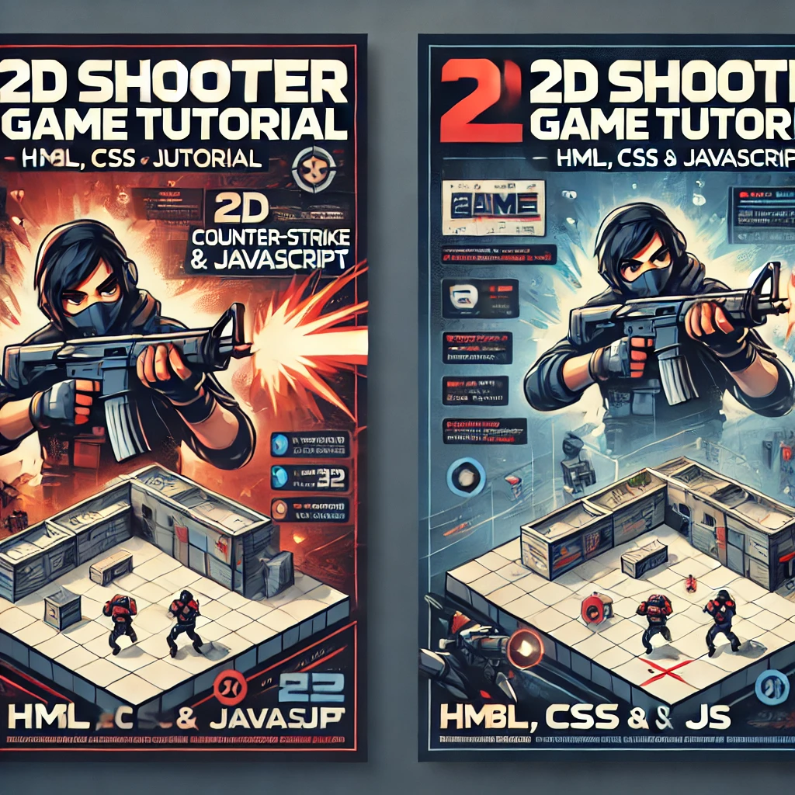

# 2D Counter-Strike Bənzəri Oyun

Bu layihə **HTML**, **CSS** və **JavaScript**-dən istifadə edərək hazırlanmış, klassik Counter-Strike oyununa bənzər 2D oyun təcrübəsi təqdim edən bir oyundur.

## Xüsusiyyətlər

- **2D Oyun Mexanikası:** Klassik Counter-Strike stilində sadə və əyləncəli oyun.
- **Responsive Dizayn:** Həm masaüstü, həm də mobil cihazlarda işləyir.
- **İnteraktiv Oyun Təcrübəsi:** Klaviatura və siçan dəstəyi ilə oyun idarəsi.
- **Web Texnologiyaları:** HTML, CSS və JavaScript ilə tam inkişaf etdirilib.

## Texnologiyalar

- **HTML:** Səhifənin strukturunu yaratmaq üçün.
- **CSS:** Dizayn və animasiyalar üçün.
- **JavaScript:** Oyun məntiqi və interaktiv elementlərin idarə olunması üçün.

## Layihəyə Başlamaq

### Tələblər

- Ən son versiyalı bir **web brauzer** (Chrome, Firefox və s.).
- **Git** (repo-nu klonlamaq üçün).

### Quraşdırma

1. **Repo-nu klonlayın:**

   ```bash
   git clone https://github.com/sizin-istifadeci-adi/oyun-repo.git




## YouTube Video

[](https://www.youtube.com/watch?v=JsnGg-CJzKs)
